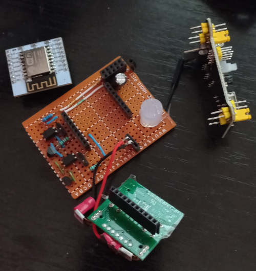
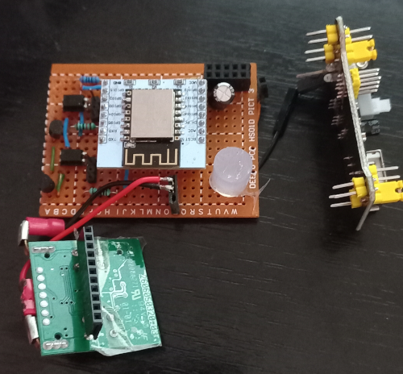
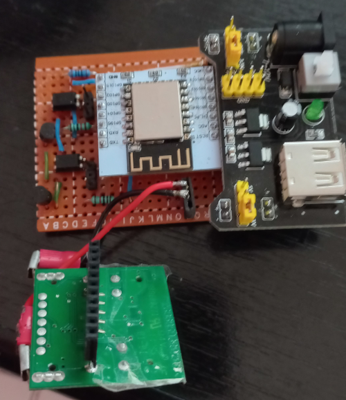
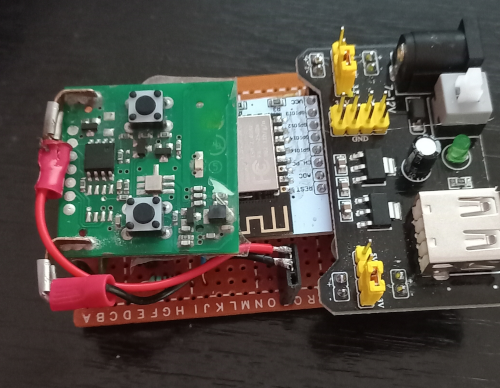
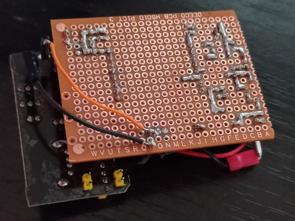
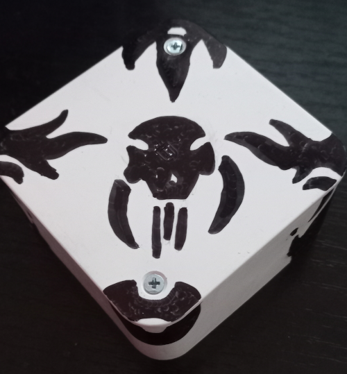

## Pictures of anssambled board

- YwRobot Breadboard (Top Right)
- ESP12-F + Expansion Board (Top Left - Whithe board)
- Roger H80/TX22 board (Bottom Center) 
- Single Layer Perfboard

The ESP-12F was mounted in some female header jumper connectors soldiered on perfboard
Note: Current used by Roger remote is 12 Volts so it requires a distinct rail linked directly to 12V power supply.

YwRobot Breadboard was mounted as well in some female header jumper connectors  

Mounted Roger 433 Mhz remote board.

Back image of perfboard.

The entire circuit was was monted in some plastic box bought from local electric store. 

The drawings are made by my son. :) 

